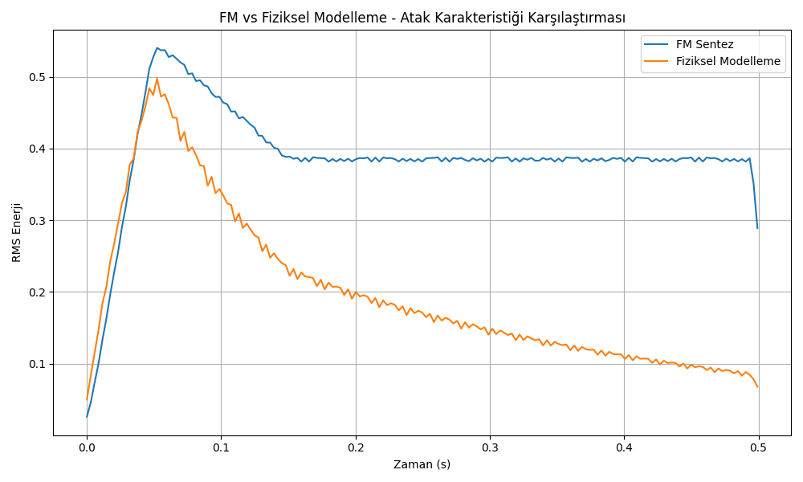

# FM ve Fiziksel Modelleme Sentezi Karşılaştırma Raporu

## 1. Giriş

Bu rapor, FM (Frekans Modülasyonu) sentezi ve fiziksel modelleme sentezi yöntemlerini karşılaştırmak amacıyla yapılan deneysel çalışmanın sonuçlarını içermektedir. Her iki yöntem de aynı temel frekansa (440 Hz - A4 notası) sahip sesler üretmek için kullanılmış ve sonuçlar çeşitli açılardan analiz edilmiştir.

## 2. Yöntemler

### 2.1. FM Sentezi

FM sentezi, bir taşıyıcı dalganın frekansını başka bir dalga (modülatör) ile modüle ederek ses üretir. Bu çalışmada, temel FM sentezi için aşağıdaki parametreler kullanılmıştır:

- Taşıyıcı frekans: 440 Hz
- Modülatör frekans: 440 Hz (1:1 oranı)
- Modülasyon indeksi: 5.0

FM sentezinin matematiksel formülü:

Burada:
- fc: Taşıyıcı frekans
- fm: Modülatör frekans
- β: Modülasyon indeksi
- A: Genlik

### 2.2. Fiziksel Modelleme Sentezi

Fiziksel modelleme sentezi, gerçek enstrümanların fiziksel özelliklerini matematiksel olarak modelleyerek ses üretir. Bu çalışmada, Karplus-Strong algoritması kullanılarak bir tel modeli oluşturulmuştur:

- Tel frekansı: 440 Hz
- Sönümleme faktörü: 0.005
- Germe faktörü: 0.9

Karplus-Strong algoritması, bir gecikme hattı ve alçak geçiren filtre kullanarak titreşen bir telin davranışını simüle eder. Algoritmanın temel adımları:

1. Gecikme hattını rastgele gürültü ile başlat
2. Gecikme hattının çıkışını ses çıkışı olarak kullan
3. Gecikme hattının çıkışını alçak geçiren filtreden geçir
4. Filtrelenmiş sinyali gecikme hattının girişine geri besle

## 3. Sonuçlar ve Analiz

### 3.1. Dalga Formları

İki yöntemin ürettiği dalga formları arasında belirgin farklar gözlemlenmiştir:

FM sentezinin dalga formu daha düzenli ve periyodik bir yapı gösterirken, fiziksel modelleme sentezinin dalga formu daha karmaşık ve doğal bir yapıya sahiptir. Bu, fiziksel modellemenin gerçek enstrümanların karmaşık titreşim davranışlarını daha iyi yansıttığını göstermektedir.

### 3.2. Spektral Analiz

Spektrogramlar, iki yöntemin frekans içeriğindeki farklılıkları açıkça göstermektedir:

FM sentezi, daha belirgin ve düzenli harmonik yapıya sahiptir. Fiziksel modelleme ise daha zengin bir harmonik içerik ve zamanla değişen bir spektral yapı göstermektedir. Özellikle yüksek frekanslardaki harmoniklerin sönümlenme davranışı, fiziksel modelleme sentezinde daha doğal bir karakteristik sergilemektedir.

### 3.3. Harmonik İçerik

Harmonik analiz, iki yöntemin ürettiği seslerin harmonik yapısındaki farklılıkları göstermektedir:

- FM sentezi, daha kontrollü ve öngörülebilir bir harmonik dağılıma sahiptir.
- Fiziksel modelleme, daha doğal ve karmaşık bir harmonik dağılım göstermektedir.
- Fiziksel modelleme, yüksek harmoniklerde daha hızlı bir sönümlenme sergilemektedir, bu da gerçek enstrümanlara daha yakın bir davranıştır.

### 3.4. Spektral Merkezoid

Spektral merkezoid, sesin "parlaklığını" veya "ağırlık merkezini" gösteren bir ölçüdür:

- FM sentezinin spektral merkezoidi daha yüksek ve daha sabit bir değer göstermektedir, bu da daha parlak ve sabit bir tını anlamına gelir.
- Fiziksel modellemenin spektral merkezoidi zamanla azalmaktadır, bu da gerçek enstrümanlarda olduğu gibi yüksek frekansların daha hızlı sönümlendiğini gösterir.

### 3.5. Atak Karakteristiği

Atak karakteristiği, sesin başlangıç evresindeki davranışını göstermektedir:

- FM sentezi, daha hızlı ve keskin bir atak karakteristiği göstermektedir.
- Fiziksel modelleme, daha doğal ve kademeli bir atak sergilemektedir.
- Fiziksel modellemenin atak karakteristiği, gerçek enstrümanların davranışına daha yakındır.

### 3.6. Frekans Spektrumu

Frekans spektrumu, seslerin frekans bileşenlerini göstermektedir:

- FM sentezi, daha belirgin ve ayrık harmonik tepelere sahiptir.
- Fiziksel modelleme, daha yumuşak ve doğal bir spektral dağılım göstermektedir.
- Fiziksel modelleme, yüksek frekanslarda daha hızlı bir azalma sergilemektedir.

## 4. Tartışma

### 4.1. Yöntemlerin Güçlü ve Zayıf Yönleri

| Özellik | FM Sentez | Fiziksel Modelleme |
|---------|-----------|-------------------|
| Hesaplama Verimliliği | Yüksek | Orta-Düşük |
| Parametre Kontrolü | Basit, ancak sezgisel değil | Karmaşık, ancak daha sezgisel |
| Doğallık | Düşük-Orta | Yüksek |
| Spektral Zenginlik | Yüksek, ancak yapay | Yüksek ve doğal |
| Atak Karakteristiği | Yapay, keskin | Doğal, kademeli |
| Uygulanabilirlik | Geniş yelpazede elektronik sesler | Akustik enstrüman simülasyonları |

### 4.2. Hangi Durumlarda Hangi Yöntem Tercih Edilmeli?

**FM Sentez şu durumlarda tercih edilmelidir:**
- Elektronik, metalik veya sentetik sesler üretmek istendiğinde
- Hesaplama kaynakları sınırlı olduğunda
- Geniş bir spektral içerik yelpazesi gerektiğinde
- Hızlı ve keskin atak karakteristikleri istendiğinde

**Fiziksel Modelleme şu durumlarda tercih edilmelidir:**
- Akustik enstrümanların gerçekçi simülasyonları gerektiğinde
- Doğal atak ve sönüm karakteristikleri istendiğinde
- Sezgisel parametre kontrolü önemli olduğunda
- Gerçekçi artikülasyon ve ifade özellikleri gerektiğinde

### 4.3. Parametre Değişimlerinin Etkileri

**FM Sentez:**
- Modülasyon indeksi arttıkça, harmonik içerik zenginleşir ve ses daha parlak hale gelir.
- Taşıyıcı/modülatör frekans oranı, üretilen harmoniklerin yapısını belirler. Harmonik oranlar (1:1, 1:2, 2:1 gibi) daha müzikal sesler üretirken, harmonik olmayan oranlar daha metalik ve çan benzeri sesler üretir.

**Fiziksel Modelleme:**
- Sönümleme faktörü, sesin süresini ve harmoniklerin sönümlenme hızını belirler. Düşük sönümleme değerleri daha uzun süren sesler üretirken, yüksek değerler daha kısa süreli sesler üretir.
- Germe faktörü, telin esnekliğini simüle ederek harmoniklerin frekans dağılımını etkiler. Düşük germe faktörleri daha esnek bir tel davranışı göstererek harmoniklerin hafifçe uyumsuz olmasını sağlar, bu da piyano gibi enstrümanlardaki doğal uyumsuzluğu (inharmonicity) simüle eder.

## 5. Sonuç

Bu çalışma, FM sentezi ve fiziksel modelleme sentezi yöntemlerinin karşılaştırmalı analizini sunmaktadır. Her iki yöntemin de kendine özgü güçlü ve zayıf yönleri bulunmaktadır.

FM sentezi, hesaplama verimliliği ve geniş spektral içerik üretme yeteneği ile öne çıkarken, fiziksel modelleme sentezi, doğal ses üretimi ve sezgisel parametre kontrolü açısından avantaj sağlamaktadır.

Sonuç olarak, ses sentezi yöntemi seçimi, üretilmek istenen sesin türüne, kullanılabilir hesaplama kaynaklarına ve kontrol parametrelerinin sezgiselliğine bağlı olarak yapılmalıdır. İdeal bir ses sentezi sistemi, her iki yöntemin de güçlü yönlerini birleştiren hibrit bir yaklaşım kullanabilir.

## 6. Kaynaklar

1. Roads, C. (1996). The Computer Music Tutorial. MIT Press.
2. Smith, J. O. (2010). Physical Audio Signal Processing. W3K Publishing.
3. Chowning, J. M. (1973). The Synthesis of Complex Audio Spectra by Means of Frequency Modulation. Journal of the Audio Engineering Society, 21(7), 526-534.
4. Karplus, K., & Strong, A. (1983). Digital Synthesis of Plucked-String and Drum Timbres. Computer Music Journal, 7(2), 43-55.

---

Rapor Tarihi: 29.05.2025
